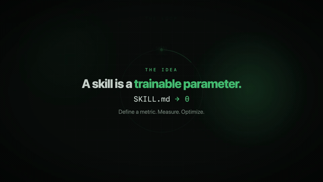

<div align="center">

# 🏭 Skill Factory

**Train agent skills like you train weights.**

Stop hand-tweaking `SKILL.md` and hoping. Define what "good" means, and let an
optimizer *measurably* improve the skill against held-out data.

[](https://github.com/FrancoisChastel/skill-factory/actions/workflows/ci.yml)
[](LICENSE)
[](https://www.python.org/)
[](CONTRIBUTING.md)
[](https://github.com/vercel-labs/skills)



<sub>▶ Full 45s explainer video is attached to every <a href="https://github.com/FrancoisChastel/skill-factory/releases">release</a>.</sub>

</div>

---

Skill Factory treats a `SKILL.md` as a **trainable parameter**: you give it a
metric and a dataset, and a pluggable optimizer evolves the skill to maximize the
metric — the same idea behind [Microsoft SkillOpt](https://github.com/microsoft/SkillOpt)
and [DSPy GEPA](https://dspy.ai), under one clean interface, plus a self-contained
optimizer that needs no heavy dependencies.

Optimized skills are emitted in the open [`npx skills`](https://github.com/vercel-labs/skills)
layout, so they drop straight into **Claude Code, Codex, Cursor, Gemini CLI**, and more.

## Why

Prompt/skill authoring is usually vibes: edit, eyeball a couple of cases, ship.
Skill Factory makes it an experiment you can reproduce and defend:

- **Measured, not guessed** — every candidate is scored on a held-out validation split.
- **Validation-gated** — an edit is kept only if it *beats* the current best. No regressions.
- **Provider- and harness-agnostic** — optimize once, run anywhere.
- **Honest by construction** — the whole pipeline is verifiable offline with a fake model.

## The scientific loop

Every optimizer reduces to the same five primitives and the same loop:

```
   Skill (SKILL.md, the trainable text)
     │
     ▼
   Harness ─run(skill, task)→ Rollout ─→ Metric ─→ score + feedback
     ▲                                                   │
     └────── Optimizer (reflect on feedback, edit, ──────┘
             keep only if it beats validation)
```

| Primitive  | What it is                              | Where |
| ---------- | --------------------------------------- | ----- |
| `Skill`    | A `SKILL.md` document (frontmatter+body)| `core/skill.py` |
| `Dataset`  | Tasks with optional gold answers        | `core/task.py` |
| `Harness`  | Runs a skill on a task → `Rollout`      | `harness/` |
| `Metric`   | Scores a rollout **+ returns feedback** | `metrics/` |
| `Optimizer`| Mutates the skill to maximize the metric| `optimizers/` |

The textual feedback is load-bearing: reflective optimizers read *why* a rollout
scored low to decide how to edit the skill.

## Install

```bash
python -m venv .venv && source .venv/bin/activate
pip install -e ".[anthropic]"     # default Claude backend
# extras: [openai] [dspy] [skillopt] [dev]  ·  or [all]
```

Copy `.env.example` → `.env` and add your key(s).

## Quickstart

```bash
skill-factory optimize -c examples/invoice-extractor/config.yaml   # optimize
cat runs/invoice-extractor/report.md                               # scorecard
npx skills add dist/invoice-extractor                              # install the result
```

Also: `skill-factory evaluate` · `export` · `list` · `ui`.

## Results (verified live)

Both examples, run end-to-end against a **local** `gemma-4-31b-it-mlx` (LM Studio,
zero API cost). One validation-gated reflective edit rewrote each vague seed into a
structured skill (schema, strict output format, normalization rules):

| Example | Task | Baseline → Best |
| ------- | ---- | --------------- |
| `invoice-extractor` | JSON extraction | **0.559 → 1.000** (+44 pts) |
| `ticket-classifier` | classification  | **0.151 → 1.000** (+85 pts) |

Reproduce with `examples/*/config.lmstudio.yaml`.

## Metrics — combine all three

Configured under `metric:` and merged by weight; a metric that can't apply to a
task is dropped, not penalized.

```yaml
metric:
  golden:                 # compare to a labeled expected answer
    mode: json_equal      # exact | normalized | token_f1 | json_equal | numeric
    weight: 2.0
  programmatic:           # deterministic checks
    weight: 1.0
    checks: [is_valid_json, {json_has_keys: [vendor, date, total, currency]}]
  judge:                  # rubric-based LLM-as-judge
    weight: 1.0
    criteria:
      - {name: correctness, description: "all fields correct?", weight: 3}
      - {name: format, description: "strict JSON, no prose?", weight: 2}
```

## Optimizers — pluggable backends

Select with `optimizer.name`.

| Name        | Needs            | Notes |
| ----------- | ---------------- | ----- |
| `llm_loop`  | just an LLM key  | **Default.** Self-contained reflective, validation-gated loop. |
| `dspy_gepa` | `[dspy]`         | DSPy GEPA reflective/evolutionary search. |
| `skillopt`  | your SkillOpt setup | Bridges to [Microsoft SkillOpt](https://github.com/microsoft/SkillOpt) (`best_skill.md`). |

All backends report a comparable `baseline → best` because the final skill is
always scored through the same harness + metric.

## Providers — bring any model

Set per role — the **target** runs the skill, the **optimizer** proposes edits,
the **judge** scores:

`anthropic` · `openai` · `azure` · `openrouter` · `together` · `groq` ·
`deepseek` · `vllm` · `lmstudio` · `ollama` (any OpenAI-compatible endpoint).

```yaml
provider:           {name: anthropic, model: claude-sonnet-5}    # target
optimizer_provider: {name: anthropic, model: claude-opus-4-8}    # proposes edits
judge_provider:     {name: ollama,    model: llama3.1}           # judge (local, free)
```

### Run it free, fully local

Point every role at a local OpenAI-compatible server (LM Studio, Ollama, vLLM)
and optimize at zero cost — the `*.lmstudio.yaml` configs do exactly this.

## Optional web UI

A zero-dependency dashboard (Python stdlib) to browse runs, score timelines, and
seed↔best skill diffs, and to launch runs:

```bash
skill-factory ui --runs runs      # → http://127.0.0.1:8765
```

## Architecture

```
src/skill_factory/
├── core/          skill · task · rollout · result   (dependency-light primitives)
├── metrics/       golden · programmatic · llm_judge · composite
├── harness/       anthropic_api · callable
├── optimizers/    llm_loop · dspy_gepa · skillopt  (+ lazy registry)
├── llm/           client · openai_compat · factory  (multi-provider)
├── evaluate.py    run a skill across a dataset → Evaluation
├── builder.py     config → live objects → run
├── export.py      emit npx skills-compatible directories
├── persistence.py save/load runs (report.md, best_skill.md, result.json)
├── ui/            optional stdlib web dashboard
├── config.py      declarative YAML run config
└── cli.py         skill-factory <command>
video/             Remotion source for the explainer video
```

## Development

```bash
pip install -e ".[dev]"
pytest              # fully offline: fake LLM + callable harness
pytest --cov        # ~80% coverage
```

Rebuild the explainer video (needs Node + ffmpeg):

```bash
cd video && npm install
npm run render      # → video/out/explainer.mp4
```

## Roadmap

- Transitions/crossfades and optional narration in the explainer
- More harnesses (Claude Code / Codex CLI subprocess) so skills optimize *in situ*
- PyPI publish + `pipx` install
- A gallery of community-contributed skills + configs

## Contributing

PRs welcome — see [CONTRIBUTING.md](CONTRIBUTING.md). Keep the core
dependency-light and everything testable offline.

## Credits

- [Microsoft SkillOpt](https://github.com/microsoft/SkillOpt) — agent skills as trainable parameters
- [Microsoft PromptWizard](https://github.com/microsoft/PromptWizard) — feedback-driven prompt optimization
- [DSPy / GEPA](https://dspy.ai) — reflective/evolutionary program optimization
- [npx skills](https://github.com/vercel-labs/skills) — the open agent-skills format
- Explainer video built with [Remotion](https://remotion.dev)

## License

[MIT](LICENSE) © 2026 François Chastel
